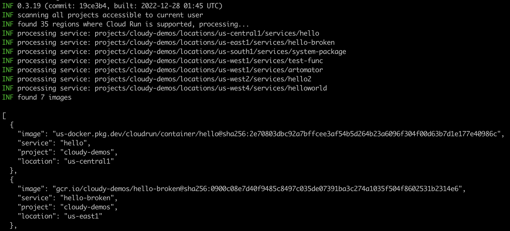

[](https://github.com/mchmarny/disco/actions/workflows/on-push.yaml)
[](https://github.com/mchmarny/disco/actions/workflows/on-tag.yaml)
[](https://codecov.io/gh/mchmarny/disco)
[](https://github.com/mchmarny/disco/releases/latest)
[](https://github.com/mchmarny/disco)
[](https://goreportcard.com/report/github.com/mchmarny/disco)
[](https://github.com/mchmarny/disco/blob/main/LICENSE)

# disco 

Utility for bulk image, license, and vulnerability discovery in containerize workloads on GCP.

> Note: this is a personal project, not an official Google product.

Features:

* Discover currently deployed container images
  * multiple project and region report with filters
  * deployed image to digest resolution
* Report on vulnerabilities or licenses in these images
  * supports operating system and package-level scans



## Why

It's easy to end up with a large number of containerized workloads across many GCP projects and regions: Cloud Run, GKE, even Cloud Functions (yes, those end up running as a container too). You can scan these containers in Artifact Registry using Google Container Analysis service, but currently it only covers base OS. It's also not easy to know which of these images (and which versions) are actually being used in active services. Services like Cloud Run also support multiple revisions, each potentially using a different version of an image, or even different image all together.

`disco` provides an easy way to `disco`ver which of these container images are currently deployed, and, if one of the supported open source scanners is installed, `disco` automatically scans these images for any vulnerabilities or to list the types of licenses used in OS or packages used by those images. 

## Install

`disco` CLI is available via the most common distribution methods. The full list of installation options is available on the [installation](INSTALL.md) page.

## Usage

```shell
disco [runtime] [command] [arguments...]
```

> You can use the `--help` flag on any level to get more information about the runtime, commands, of `disco` itself.

The command options available for all the runtimes include:

* `--project` - runs only on specific project (project ID)
* `--format`  - specifies report format: `json`, `yaml`, `raw` (`json` by default)
* `--output`  - saves report to file at this path (stdout by default) 

### Cloud Run 

To see all of the commands available for `run`:

```shell
disco run --help
```

* [Images](#images)
* [Licenses](#licenses)
* [Vulnerabilities](#vulnerabilities)

#### Images

To discover container images currently deployed in Cloud Run:

```shell
disco run images
```

The `images` command supports all of the generic options listed above, plus: 

* `--uri` - outputs only image uri (default: false). This is helpful when you want to pipe the resulting images to another program.

The resulting report in JSON format will look something like this (abbreviated):

```json
[
  {
    "image": "https://us-docker.pkg.dev/cloudrun/container/hello@sha256:2e70803dbc92a7bffcee3af54b5d264b23a6096f304f00d63b7d1e177e40986c",
    "service": "hello",
    "project": "cloudy-demos",
    "location": "us-central1"
  },
  ...
]
```

#### Licenses

To discover licenses used in container images currently deployed in Cloud Run.

```shell
disco run licenses
```

The `licenses` command supports all of the generic options listed above, plus: 

* `--source` - path to image list file to use as source. This allows you to use the previously generated list of images (`disco run img --uri -o images.txt`), instead of running through potentially lengthy discovery. 
* `--image` - specific image URI to scan. (Note: `source` and `image` are mutually exclusive.)

The resulting report in JSON format will look something like this (abbreviated):

```json
[
  {
    "image": "us-docker.pkg.dev/cloudrun/container/hello@sha256:2e70803dbc92a7bffcee3af54b5d264b23a6096f304f00d63b7d1e177e40986c",
    "licenses": [
      {
        "name": "GPL-2.0",
        "source": "alpine-baselayout"
      },
      {
        "name": "MPL-2.0",
        "source": "ca-certificates"
      },
      {
        "name": "MIT",
        "source": "ca-certificates"
      },
      ...
    ]
  },
  ...
]
```

#### Vulnerabilities

To discover potential vulnerabilities in container images currently deployed in Cloud Run.

```shell
disco run licenses
```

The `licenses` command supports all of the generic options listed above, plus: 

* `--source` - path to image list file to use as source. This allows you to use the previously generated list of images (e.g. `disco run img --uri -o images.txt`). If not provided, `disco` will discover images first. 
* `--image` - specific image URI to scan. (Note: `source` and `image` are mutually exclusive.)
* `--min-severity` - minimum vulnerability severity to include in report (e.g. low, medium, high, critical, default: all)
* `--cve` - filters report on a specific CVE. This enables quick search if anything currently running is exposed to new CVE.
* `--use-ca`  - invokes Container Analysis API instead of the local scanner (default: false). 

The resulting report in JSON format will look something like this (abbreviated):

```json
[
  {
    "image": "gcr.io/cloudy-demos/hello-broken@sha256:0900c08e7d40f9485c8497c035de07391ba3c274a1035f504f8602531b2314e6",
    "vulnerabilities": [
      {
        "source": "CVE-2022-3715",
        "severity": "LOW",
        "package": "bash",
        "version": "5.1-6ubuntu1",
        "title": "bash: a heap-buffer-overflow in valid_parameter_transform",
        "description": "A flaw was found in the bash package, where a heap-buffer overflow can occur in valid_parameter_transform. This issue may lead to memory problems.",
        "url": "https://avd.aquasec.com/nvd/cve-2022-3715",
        "updated": "2022-12-23T16:52:00Z"
      },
      ...
    ]
  },
  ...
]
```

### GKE

> Not yet implemented.


## OSS

[](https://app.fossa.com/projects/git%2Bgithub.com%2Fmchmarny%2Fdisco?ref=badge_large)


## Disclaimer

This is my personal project and it does not represent my employer. While I do my best to ensure that everything works, I take no responsibility for issues caused by this code.
