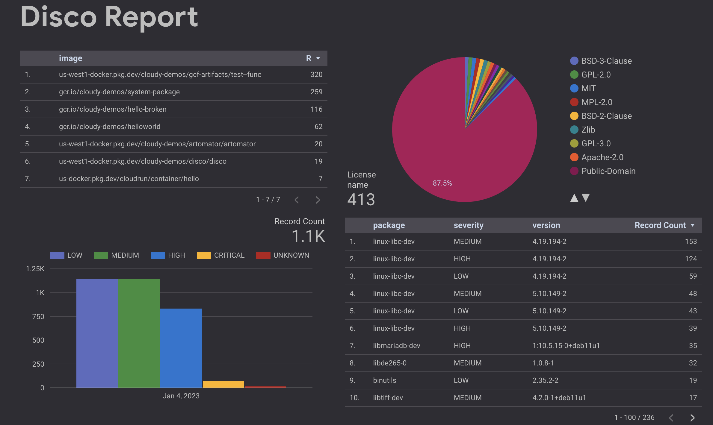

[](https://github.com/mchmarny/disco/actions/workflows/on-push.yaml)
[](https://github.com/mchmarny/disco/actions/workflows/on-tag.yaml)
[](https://codecov.io/gh/mchmarny/disco)
[](https://github.com/mchmarny/disco/releases/latest)
[](https://github.com/mchmarny/disco)
[](https://goreportcard.com/report/github.com/mchmarny/disco)
[](https://github.com/mchmarny/disco/blob/main/LICENSE)

# disco 

Utility for bulk image, license, and vulnerability discovery in containerize workloads on GCP.

> Note: this is a personal project, not an official Google product.

Features:

* Runs as a CLI or a Cloud Run service
* Discover currently deployed container images
  * multiple project and region report with filters
  * deployed image to digest resolution
* Report on vulnerabilities or licenses in these images
  * supports operating system and package-level scans
* Find out if those images are impacted by a specific CVE
* When ran as a service:
  * Creates time-series metrics in Cloud Monitoring (charts, alerts)
  * Exports Licenses and Vulnerabilities to BigQuery tables 
  * Creates Looker Studio dashboard



## Why

It's easy to end up with a large number of containerized workloads across many GCP projects and regions: Cloud Run, GKE, or even Cloud Functions (yes, those end up running as a container too). You can scan these containers in Artifact Registry using [Container Analysis](https://cloud.google.com/container-analysis/docs/container-analysis) service, but currently it only [covers base OS](https://cloud.google.com/container-analysis/docs/os-overview). It's also not easy to know which of these images (and which versions) are actually being used in active services. Services like Cloud Run also support [multiple revisions](https://cloud.google.com/run/docs/managing/revisions), each potentially using a different version of an image.

`disco` provides an easy way to `disco`ver which of these container images are currently deployed. And, if one of the supported open source scanners is installed, `disco` automatically scans these images for any vulnerabilities, or lists the types of licenses used in those images. 

## Install

You can install `disco` as either a CLI or a service:

* [CLI](INSTALL.md) - Available via the most common distribution methods (Homebrew, RPM, DEB, Go, Binary etc.)
* [SERVER](SERVER.md) - Cloud Run service deployed via Terraform

## CLI Usage

```shell
disco [runtime] [command] [arguments...]
```

> You can use the `--help` flag on any level to get more information about the runtime, commands, of `disco` itself.

The command options available for all the runtimes include:

* `--project` - runs only on specific project (project ID)
* `--format`  - specifies report format: `json`, `yaml`, `raw` (`json` by default)
* `--output`  - saves report to file at this path (stdout by default) 

### Cloud Run 

To see all of the commands available for `run`:

```shell
disco run --help
```

* [Images](#images)
* [Licenses](#licenses)
* [Vulnerabilities](#vulnerabilities)

#### Images

To discover container images currently deployed in Cloud Run:

```shell
disco run img
```

The `images` or `img` command supports all of the generic options listed above, plus: 

* `--uri` - outputs only image uri (default: false). This is helpful when you want to pipe the resulting images to another program.

The resulting report in JSON format will look something like this (abbreviated):

```json
{
  "meta": {
    "kind": "image",
    "version": "v0.3.19-next",
    "created": "2022-12-28T21:20:15Z",
    "count": 7
  },
  "items": [
    {
      "uri": "us-docker.pkg.dev/cloudrun/container/hello@sha256:2e70803dbc92a7bffcee3af54b5d264b23a6096f304f00d63b7d1e177e40986c",
      "context": {
        "container-name": "hello-1",
        "location-id": "us-central1",
        "location-name": "Iowa",
        "project-id": "cloudy-demos",
        "project-number": "799736955886",
        "service-id": "projects/cloudy-demos/locations/us-central1/services/hello",
        "service-name": "hello",
        "service-revision": "projects/cloudy-demos/locations/us-central1/services/hello/revisions/hello-00001-taj"
      }
    },
      ...
  ]
}
```

#### Licenses

To discover licenses used in container images currently deployed in Cloud Run.

```shell
disco run lic
```

The `licenses` or `lic` command supports all of the generic options listed above, plus: 

* `--source` - path to image list file to use as source. This allows you to use the previously generated list of images (`disco run img --uri -o images.txt`), instead of running through potentially lengthy discovery. 
* `--image` - specific image URI to scan. Note: `source` and `image` are mutually exclusive.

The resulting report in JSON format will look something like this (abbreviated):

```json
{
  "meta": {
    "kind": "license",
    "version": "v0.3.19-next",
    "created": "2022-12-28T21:23:20Z",
    "count": 7
  },
  "items": [
    {
      "image": "us-docker.pkg.dev/cloudrun/container/hello@sha256:2e70803dbc92a7bffcee3af54b5d264b23a6096f304f00d63b7d1e177e40986c",
      "licenses": [
        {
          "name": "GPL-2.0",
          "source": "alpine-baselayout-data"
        },
        {
          "name": "MIT",
          "source": "alpine-keys"
        },
        ...
      ]
    },
    ...
  ]
}
```

#### Vulnerabilities

To discover potential vulnerabilities in container images currently deployed in Cloud Run.

```shell
disco run vul
```

The `vul` or `vulnerabilities` command supports all of the generic options listed above, plus: 

* `--source` - path to image list file to use as source. This allows you to use the previously generated list of images (e.g. `disco run img --uri -o images.txt`). If not provided, `disco` will discover images first. 
* `--image` - specific image URI to scan. Note: `source` and `image` are mutually exclusive.
* `--min-severity` - minimum severity of vulnerability to include in report (e.g. low, medium, high, critical, default: all).
* `--cve` - filters report on a specific CVE. This enables quick search if anything currently running is exposed to a new CVE.

The resulting report in JSON format will look something like this (abbreviated):

```json
{
  "meta": {
    "kind": "vulnerability",
    "version": "v0.3.19-next",
    "created": "2022-12-28T21:32:34Z",
    "count": 5
  },
  "items": [
    {
      "image": "gcr.io/cloudy-demos/hello-broken@sha256:0900c08e7d40f9485c8497c035de07391ba3c274a1035f504f8602531b2314e6",
      "vulnerabilities": [
        {
          "source": "CVE-2021-28165",
          "severity": "HIGH",
          "package": "org.eclipse.jetty:jetty-util",
          "version": "9.4.31.v20200723",
          "title": "jetty: Resource exhaustion when receiving an invalid large TLS frame",
          "description": "In Eclipse Jetty 7.2.2 to 9.4.38, 10.0.0.alpha0 to 10.0.1, and 11.0.0.alpha0 to 11.0.1, CPU usage can reach 100% upon receiving a large invalid TLS frame.",
          "url": "https://avd.aquasec.com/nvd/cve-2021-28165",
          "updated": "2022-07-29T17:05:00Z"
        },
        ...
      ]
    },
    ...
  ]
}
```

### Cloud Functions

> Not yet implemented.

### GKE

> Not yet implemented.


## OSS

[](https://app.fossa.com/projects/git%2Bgithub.com%2Fmchmarny%2Fdisco?ref=badge_large)


## Disclaimer

This is my personal project and it does not represent my employer. While I do my best to ensure that everything works, I take no responsibility for issues caused by this code.
