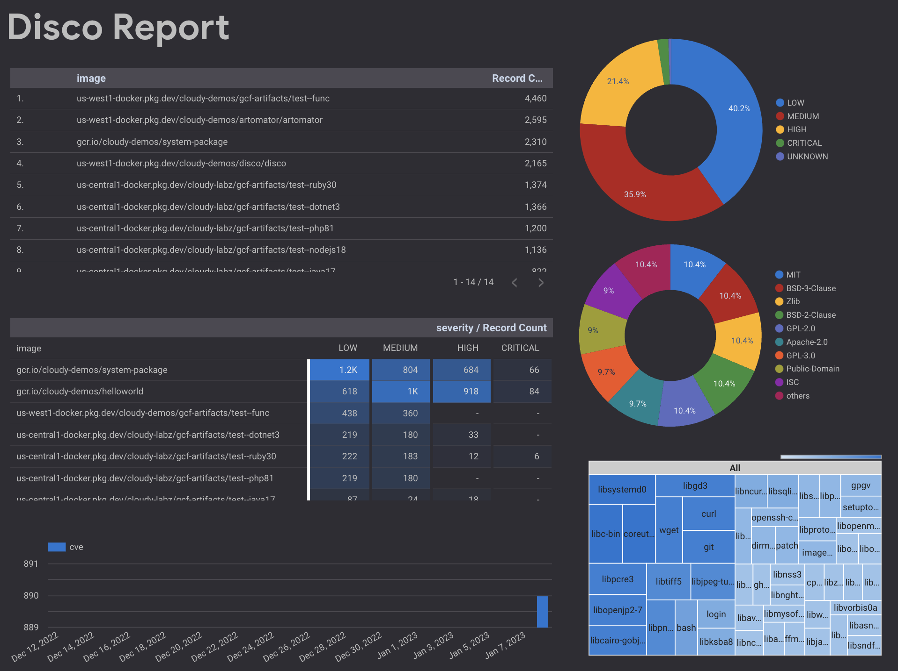
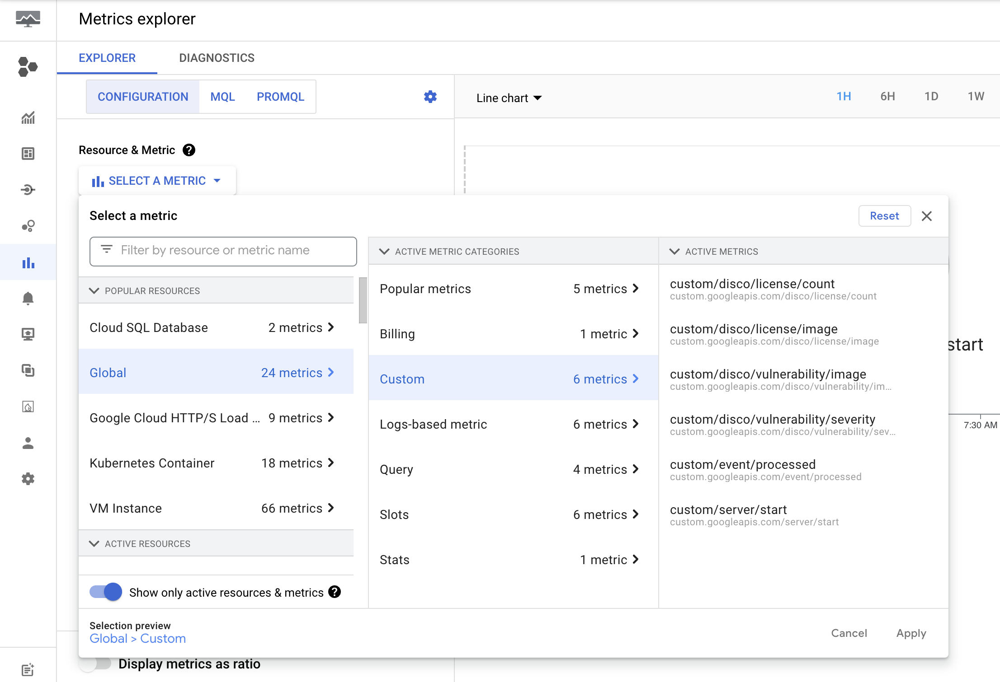
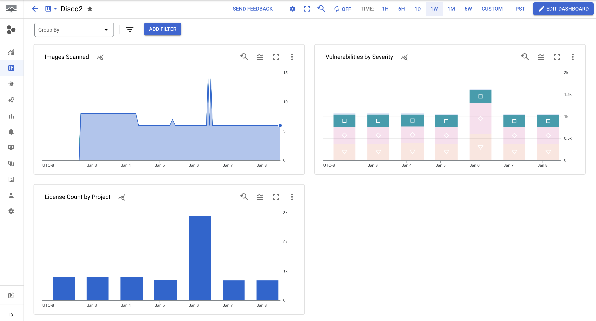
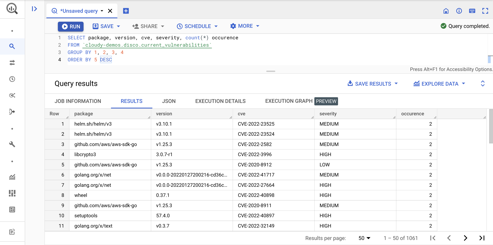

[](https://github.com/mchmarny/disco/actions/workflows/on-push.yaml)
[](https://github.com/mchmarny/disco/actions/workflows/on-tag.yaml)
[](https://codecov.io/gh/mchmarny/disco)
[](https://github.com/mchmarny/disco/releases/latest)
[](https://github.com/mchmarny/disco)
[](https://goreportcard.com/report/github.com/mchmarny/disco)
[](https://github.com/mchmarny/disco/blob/main/LICENSE)

# disco 

Utility for bulk image, license, package, and vulnerability discovery in containerize workloads on GCP.

> Note: this is a personal project, not an official Google product.

Features:

* Discover currently deployed container images in Cloud Run, GCF, and GKE
  * supports multiple project and region
  * resolves deploys deployed image to their digests
* Report on vulnerabilities, packages, or licenses in these images
  * scans base images and packages
  * supports filters (e.g CVE, package name, license type)
* Available as CLI os Service (for continuous discovery)

Additionally, when deployed as a service, `disco` will:
  * Publish custom metrics (time-series) in Cloud Monitoring to support:
    * custom charts and dashboards (e.g. image vulnerability over time)
    * metric threshold alerts (e.g. page on `CRITICAL` vulnerability in project `X`)
  * Export image license, package, and vulnerability data to BigQuery
    * query data using SQL (e.g. package versions over time)
    * create ML models (e.g. vulnerability source classification model)
    * build custom visualizations using Google Sheets, Data Studio, or Looker



## Why

It's easy to end up with a large number of containerized workloads across many GCP projects and regions: Cloud Run, GKE, or even Cloud Functions (yes, those end up running as a container too). You can scan these containers in Artifact Registry using [Container Analysis](https://cloud.google.com/container-analysis/docs/container-analysis) service, but currently it only [covers base OS](https://cloud.google.com/container-analysis/docs/os-overview). It's also not easy to know which of these images (and which versions) are actually being used in active services. Services like Cloud Run also support [multiple revisions](https://cloud.google.com/run/docs/managing/revisions), each potentially using a different version of an image, so identifying container images currently underpinning your services can get complicated. 

`disco` provides an easy way to `disco`ver which of these container images are currently deployed, and automates the vulnerability/license scanning. 

## Install

You can use `disco` either as CLI or Service:

* [CLI](docs/CLI.md) - Supports most common distribution methods (Homebrew, RPM, DEB, Go install, Binary etc).
* [Service](docs/SERVICE.md) - Deploys as a Cloud Run service via Terraform.

## Usage

### CLI

```shell
disco command [command options] [arguments...]
```

> You can use the `--help` flag on any level to get more information about the runtime, commands, of `disco` itself.

#### Images

Discover deployed images from specific runtime. To see all of the commands available for `img` (or `image`):

```shell
disco image --help
```

To discover container images currently deployed in all of the supported runtimes:

```shell
disco img
```

Options:

* `--output` - path where to save the output (stdout by default) 
* `--format` - output format (`json` or `yaml`, `json` is the default)
* `--uri` - outputs only image uri (default: false). This is helpful when you want to pipe the resulting images to another program.
* `--project` - scope discovery to a single project using project ID


The resulting report in JSON format will look something like this (abbreviated):

```json
{
  "meta": {
    "kind": "image",
    "version": "v0.3.19-next",
    "created": "2022-12-28T21:20:15Z",
    "count": 7
  },
  "items": [
    {
      "uri": "us-docker.pkg.dev/cloudrun/container/hello@sha256:2e70803dbc92a7bffcee3af54b5d264b23a6096f304f00d63b7d1e177e40986c",
      "context": {
        "container-name": "hello-1",
        "location-id": "us-central1",
        "location-name": "Iowa",
        "project-id": "cloudy-demos",
        "project-number": "799736955886",
        "service-id": "projects/cloudy-demos/locations/us-central1/services/hello",
        "service-name": "hello",
        "service-revision": "projects/cloudy-demos/locations/us-central1/services/hello/revisions/hello-00001-taj"
      }
    },
      ...
  ]
}
```

#### Vulnerabilities

Discover potential vulnerabilities in container images. To see all of the commands available for `vul` (or `vulnerability`):

```shell
disco vulnerability --help
```

Options: 

* `--file` - image list input file path to serve as a source (instead of discovery) (e.g. `disco img --uri --output images.txt`)
* `--image` - specific image URI to scan. Note: `source` and `image` are mutually exclusive
* `--output` - saves report to file at this path (stdout by default) 
* `--format` - report format: `json` or `yaml` (`json` is default)
* `--project` - during discovery, runs only on specific project (project ID)
* `--min-severity` - minimum severity of vulnerability to include in report (e.g. low, medium, high, critical, default: all)
* `--cve` - filter results on a specific CVE ID (e.g. `CVE-2020-22046`)
* `--target` - target data store to save the results to (e.g. `bq://my-project.some-dataset` or  `bq://my-project.some-dataset.table-name`)

> Using the `cve` filter you can quickly check if any of the currently deployed images have a vulnerability. 

The resulting report in JSON format will look something like this (abbreviated):

```json
{
  "meta": {
    "kind": "vulnerability",
    "version": "v0.3.19-next",
    "created": "2022-12-28T21:32:34Z",
    "count": 5
  },
  "items": [
    {
      "image": "gcr.io/cloudy-demos/hello-broken@sha256:0900c08e7d40f94...",
      "vulnerabilities": [
        {
          "source": "CVE-2021-28165",
          "severity": "HIGH",
          "package": "org.eclipse.jetty:jetty-util",
          "version": "9.4.31.v20200723",
          "title": "jetty: Resource exhaustion when receiving an invalid large TLS frame",
          "description": "In Eclipse Jetty 7.2.2 to 9.4.38, 10.0.0.alpha0 to 10.0.1, and 11.0.0.alpha0 to 11.0.1, CPU usage can reach 100% upon receiving a large invalid TLS frame.",
          "url": "https://avd.aquasec.com/nvd/cve-2021-28165",
          "updated": "2022-07-29T17:05:00Z"
        },
        ...
      ]
    },
    ...
  ]
}
```

#### Licenses

Discover licenses for OS and packages used in container images. To see all of the commands available for `lic` or `license`:

```shell
disco license --help
```

Options: 

* `--file` - image list input file path to serve as a source (instead of discovery) (e.g. `disco img --uri --output images.txt`)
* `--image` - specific image URI to scan. Note: `source` and `image` are mutually exclusive
* `--output` - saves report to file at this path (stdout by default)  
* `--format` - report format: `json` or `yaml` (`json` is default)
* `--project` - during discovery, runs only on specific project (project ID)
* `--type` - license type filter (supports prefix: e.g. `apache`, `bsd`, `mit`, etc.)
* `--target` - target data store to save the results to (e.g. `bq://my-project`)

> Using the `type` you can quickly check if any of your currently deployed images are using specific license.

The resulting report in JSON format will look something like this (abbreviated):

```json
{
  "meta": {
    "kind": "license",
    "version": "v0.3.19-next",
    "created": "2022-12-28T21:23:20Z",
    "count": 7
  },
  "items": [
    {
      "image": "us-docker.pkg.dev/cloudrun/container/hello@sha256:2e70803dbc92...",
      "licenses": [
        {
          "name": "GPL-2.0",
          "source": "alpine-baselayout-data"
        },
        {
          "name": "MIT",
          "source": "alpine-keys"
        },
        ...
      ]
    },
    ...
  ]
}
```

#### Packages

Discover packages used in container images. To see all of the commands available for `pkg` (or `packages`):

```shell
disco packages --help
```

Options: 

* `--file` - image list input file path to serve as a source (instead of discovery) (e.g. `disco img --uri --output images.txt`)
* `--image` - specific image URI to scan. Note: `source` and `image` are mutually exclusive
* `--output` - saves report to file at this path (stdout by default)  
* `--format` - report format: `json` or `yaml` (`json` is default)
* `--project` - during discovery, runs only on specific project (project ID)
* `--name` - package name filter (uses contains, e.g. libgcc, gobinary, express, etc.)
* `--target` - target data store to save the results to (e.g. `bq://my-project`)

> Using the `type` you can quickly check if any of your currently deployed images are using specific license.

The resulting report in JSON format will look something like this (abbreviated):

```json
{
  "meta": {
    "kind": "package",
    "version": "v0.9.4",
    "created": "2023-01-08T00:37:26Z",
    "count": 8
  },
  "items": [
    {
      "image": "us-central1-docker.pkg.dev/cloudy-labz/gcf-artifacts/test--go119@sha256:80be8e3c174...",
      "packages": [
        {
          "package": "minipass-sized",
          "version": "1.0.3",
          "source": "pkg:npm/minipass-sized@1.0.3",
          "license": "ISC",
          "format": "SPDX-2.2",
          "provider": "trivy"
        },
        ...
      ],
    ...
    }
  ]
}
```

### Service 

When running as a service, `disco` automatically exports metrics and report data:

#### Metrics

`disco` metrics can be found in [Metric Explorer](https://cloud.google.com/monitoring/charts/metrics-explorer)



Custom time-series metrics created by `disco`:

* `disco/vulnerability/image` - count of images scanned for vulnerability (labels: project, version)
* `disco/vulnerability/severity` - vulnerability severity count (labels: project, version, kind)
* `disco/license/image` - count of images scanned for licenses (labels: project, version)
* `disco/license/count` - count of licenses (labels: project, version)
* `disco/package/image` - count of images scanned for packages (labels: project, version)
* `disco/package/count` - count of packages (labels: project, version)

> License and packages have too high cardinality for more detail labels.



#### Data

`disco` service automatically exports its data to two BigQuery tables

Common elements:

* `batch_id` is the unique ID of each discovery operation 
* `image` is the image URI sans tag or sha
* `sha` is the image digest prefixed with `sha:`
* `updated` is the timestamp when the data element was extracted

**licenses**

```json
{name: "batch_id", type: "integer", required: true},
{name: "image", type: "string", required: true},
{name: "sha", type: "string"},
{name: "name", type: "string", required: true},
{name: "package", type: "string"},
{name: "updated", type: "timestamp", required: true}
```

**packages**

```json
{name: "batch_id", type: "integer", required: true},
{name: "image", type: "string", required: true},
{name: "sha", type: "string"},
{name: "cve", type: "string", required: true},
{name: "severity", type: "string"},
{name: "package", type: "string"},
{name: "version", type: "string"},
{name: "title", type: "string"},
{name: "description", type: "string"},
{name: "url", type: "string"},
{name: "updated", type: "timestamp", required: true}
```

**vulnerabilities**

```json
{name: "batch_id", type: "integer", required: true},
{name: "image", type: "string", required: true},
{name: "sha", type: "string"},
{name: "format", type: "string", required: true},
{name: "provider", type: "string", required: true},
{name: "package", type: "string", required: true},
{name: "version", type: "string"},
{name: "source", type: "string"},
{name: "license", type: "string"},
{name: "updated", type: "timestamp", required: true}
```

You can use these in your custom queries: 



Sample of SQL queries available [here](docs/QUERIES.md).

or in Sheet, Data Studio, or Looker reports 


## OSS

[](https://app.fossa.com/projects/git%2Bgithub.com%2Fmchmarny%2Fdisco?ref=badge_large)


## Disclaimer

This is my personal project and it does not represent my employer. While I do my best to ensure that everything works, I take no responsibility for issues caused by this code.
