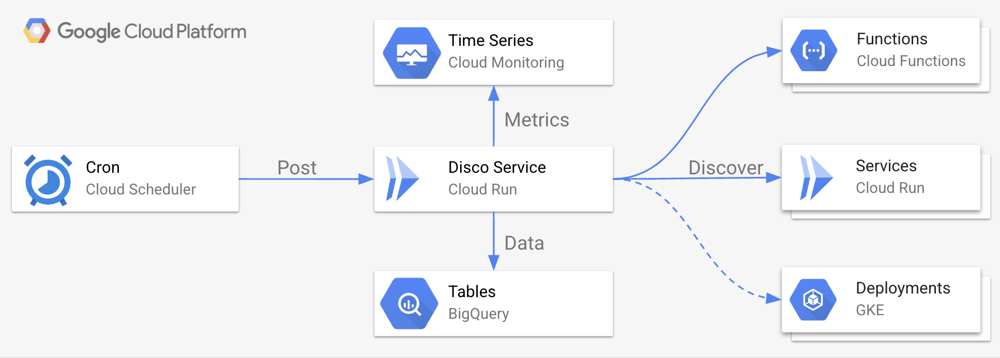
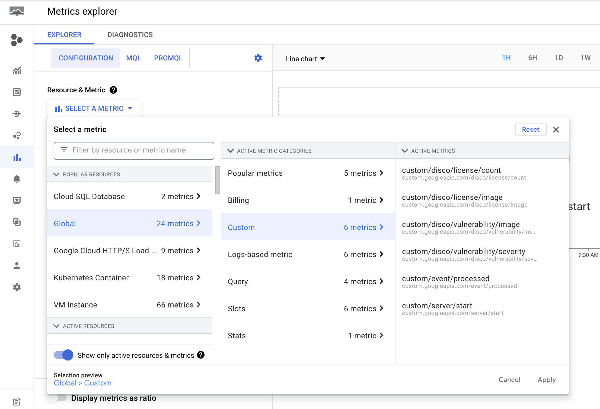
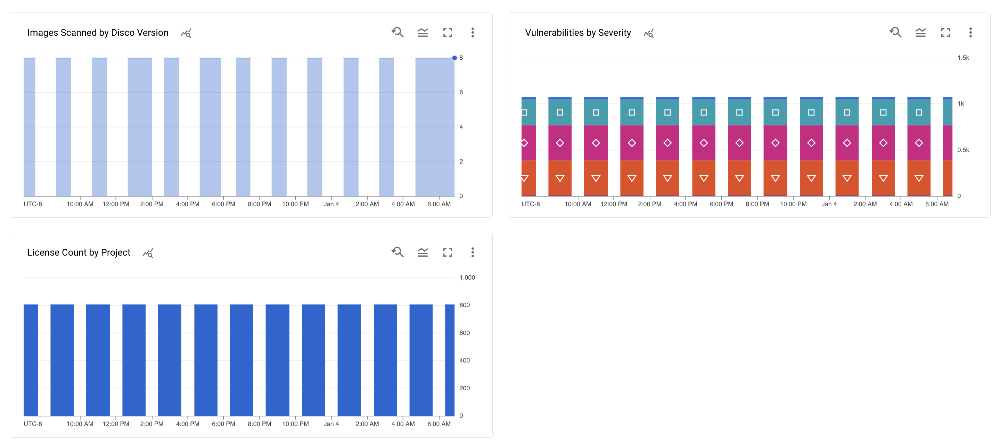
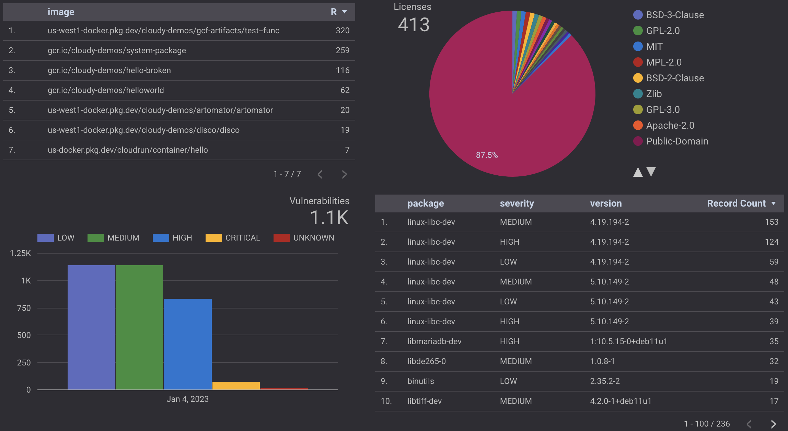

# Disco Service



* [Deployment](#deployment)
* [Usage](#usage)

## Deployment
  
To deploy the prebuilt version of `disco`, first clone this repo:

```shell
git clone git@github.com:mchmarny/disco.git
```

Then navigate to the `deploy` directory inside of that cloned repo:

```shell
cd disco/deploy
```

Next, authenticate to GCP:

```shell
gcloud auth application-default login
```

Initialize Terraform: 

```shell
terraform init
```

> Note, this flow uses the default, local terraform state. Make sure you do not check the state files into your source control (see `.gitignore`), or consider using persistent state provider like GCS.

When done, apply the Terraform configuration:

```shell
terraform apply
```

When promoted, provide requested variables:

* `project_id` is the GCP project ID (not the name)
* `location` is GCP region to deploy to
* `git_repo` qualified name of the newly cloned repo (e.g. `username/disco`)

When completed, this will output the configured resource information. 

### Test Deployment

To test the deployed `disco` service:

```shell
SERVICE_URL=$(gcloud run services describe disco \
    --region $REGION --format="value(status.url)")

curl -sS -H "Authorization: Bearer $(gcloud auth print-identity-token)" \
     -H "Content-Type: application/json" \
     -H "X-Goog-User-Project: ${PROJECT_ID}" \
     "${SERVICE_URL}/disco"
```

A correctly deployed service should return: 

```json
{ "status": "OK", "message": "Done" }
```

## Usage

When running as a service, `disco` automatically exports metrics and report data:

### Metrics

`disco` metrics can be found in 



Custom time-series metrics created by `disco`:

* `disco/vulnerability/image` - count of images scanned for vulnerability (labels: project, version)
* `disco/vulnerability/severity` - vulnerability severity count (labels: project, version, kind)
* `disco/license/image` - count of images scanned for licenses (labels: project, version)
* `disco/license/count` - count of licenses (labels: project, version)

> License type has too high cardinality for label 



### Data

`disco` exports its data to two BigQuery tables

**licenses**

* `batch_id` (INTEGER, REQUIRED) - unique ID for each scan process
* `image`	(STRING, REQUIRED) - image uri (registry qualified, no tag)
* `sha`	(STRING, NULLABLE) - image sha (e.g. sha:1234...)
* `name` (STRING, REQUIRED) - license name 
* `package` (STRING, NULLABLE) - source package where this license was found
* `updated` (TIMESTAMP, REQUIRED) - timestamp when the record was inserted

**vulnerabilities**

* `batch_id` (INTEGER, REQUIRED) - unique ID for each scan process
* `image`	(STRING, REQUIRED) - image uri (registry qualified, no tag)
* `sha`	(STRING, NULLABLE) - image sha (e.g. sha:1234...)
* `cve`	(STRING, REQUIRED) - ID of the CVE (e.g. `CVE-2022-23525`)
* `severity` (STRING, NULLABLE) - severity level fo the CVE (e.g. `LOW`, `MEDIUM`, `HIGH`, etc.)
* `package` (STRING, NULLABLE) - source package where this vulnerability was found
* `version` (STRING, NULLABLE) - version of the package where this vulnerability was found
* `title`	(STRING, NULLABLE) - short title of the vulnerability
* `description` (STRING, NULLABLE) - longer description of the vulnerability
* `url`	(STRING, NULLABLE) - URL to the CVE reference
* `updated` (TIMESTAMP, REQUIRED) - timestamp when the record was inserted

You can use these in your custom queries: 


or in Sheet, Data Studio, or Looker reports 



## Disclaimer

This is my personal project and it does not represent my employer. While I do my best to ensure that everything works, I take no responsibility for issues caused by this code.
