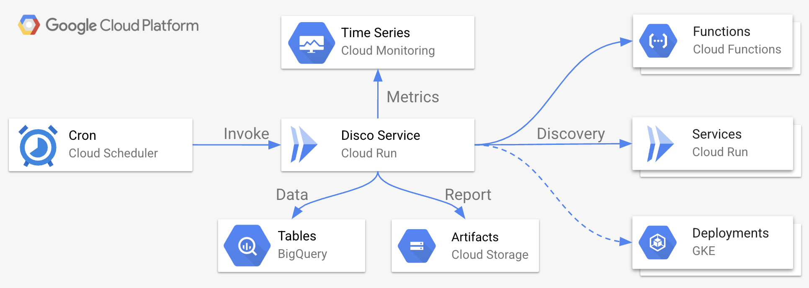

# Disco Service



* [Deployment](#deployment)
* [Usage](#usage)

## Deployment
  
To deploy the prebuilt version of `disco`, first clone this repo:

```shell
git clone git@github.com:mchmarny/disco.git
```

Then navigate to the `deploy` directory inside of that cloned repo:

```shell
cd disco/deploy
```

Next, authenticate to GCP:

```shell
gcloud auth application-default login
```

Initialize Terraform: 

```shell
terraform init
```

> Note, this flow uses the default, local terraform state. Make sure you do not check the state files into your source control (see `.gitignore`), or consider using persistent state provider like GCS.

When done, apply the Terraform configuration:

```shell
terraform apply
```

When promoted, provide requested variables:

* `project_id` is the GCP project ID (not the name)
* `location` is GCP region to deploy to
* `git_repo` qualified name of the newly cloned repo (e.g. `username/disco`)

When completed, this will output the configured resource information. 

### Test Deployment

To test the deployed `disco` service:

```shell
SERVICE_URL=$(gcloud run services describe disco \
    --region $REGION --format="value(status.url)")

curl -sS -H "Authorization: Bearer $(gcloud auth print-identity-token)" \
     -H "Content-Type: application/json" \
     -H "X-Goog-User-Project: ${PROJECT_ID}" \
     "${SERVICE_URL}/disco"
```

A correctly deployed service should return: 

```json
{ "status": "OK", "message": "Done" }
```

## Disclaimer

This is my personal project and it does not represent my employer. While I do my best to ensure that everything works, I take no responsibility for issues caused by this code.
